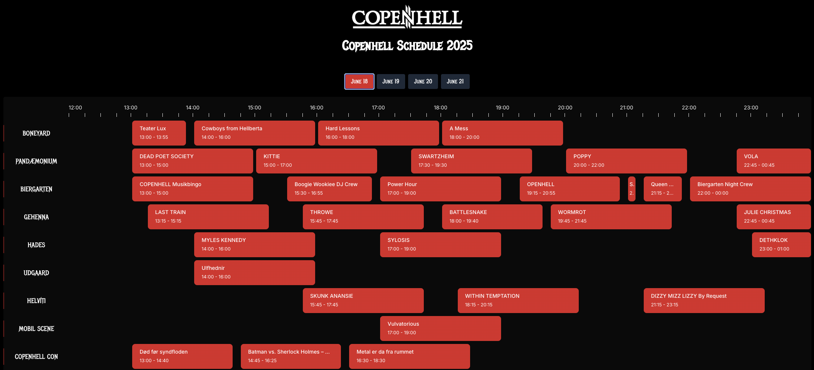

# Copenhell Schedule 2025

A web application for displaying the Copenhell festival schedule in an interactive timeline format.

The Copenhell website does not provide a schedule overview; instead, it only lists all events. This means that users must open each event individually to see when and at which stage the event is at.
Their app has a schedule (🙏), but I was missing the timeline overview —- and that's why this app was quickly made.

Works on desktop and mobile and has a vertical line for the current time on the day of the festival.

My buddy Weidick scraped the data from the Copenhell website.

## How it looks

## Where to find the app

[https://copenhell.dreijer.io](https://copenhell.dreijer.io)

## Features

- Interactive schedule viewer with a timeline interface
- Day-by-day program navigation
- Event information with descriptions and images

## Tech Stack

- **Next.js 15**
- **Planby** - TV guide/schedule component library for the interactive timeline
- **Tailwind CSS** - Styling
